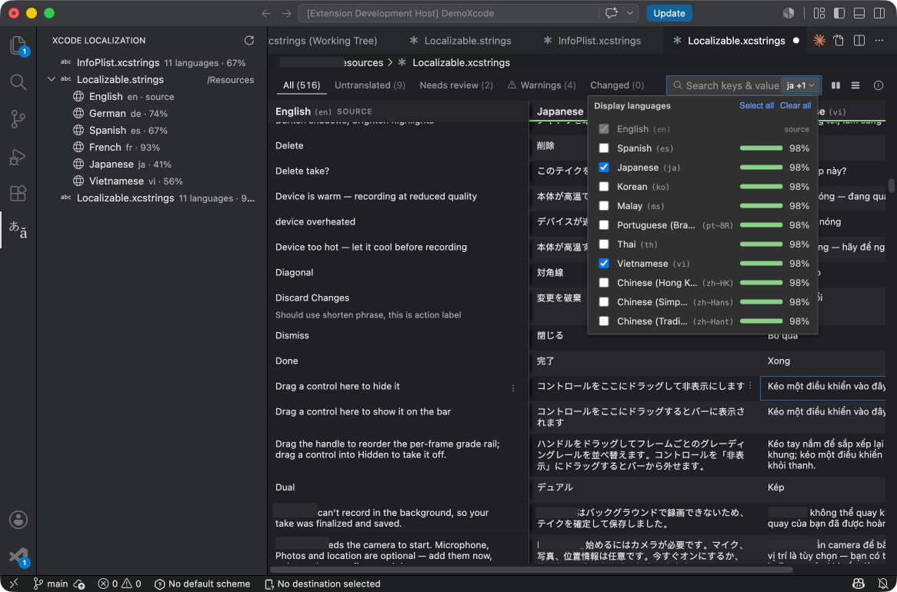
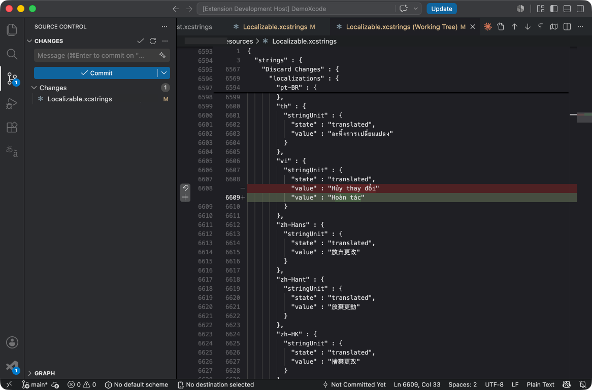
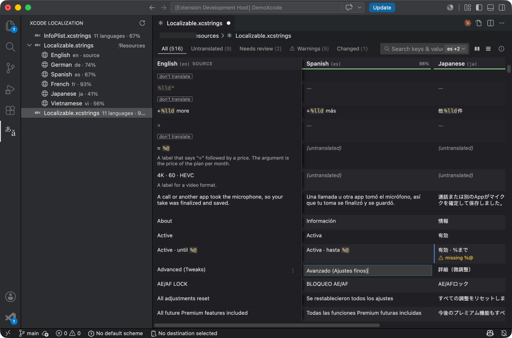
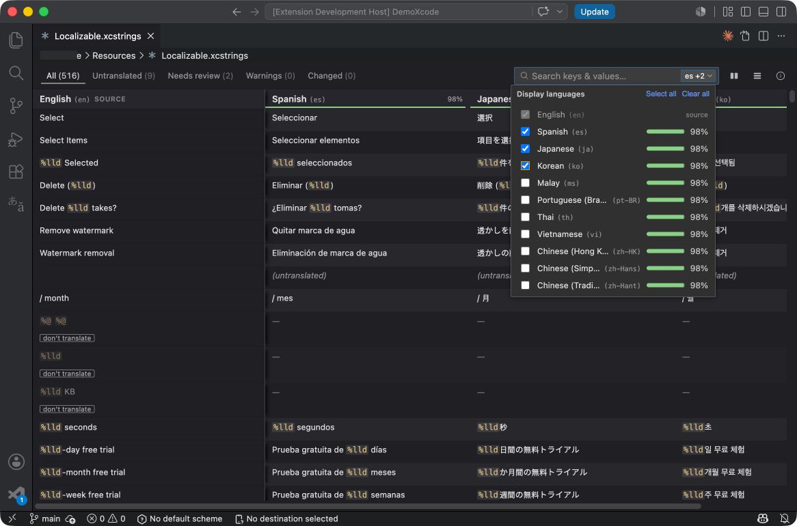

# Xcode Localization

[](LICENSE)

A fast, native-feeling visual editor for **Xcode String Catalogs** - localize your iOS, iPadOS, and macOS apps directly in VS Code, without opening Xcode.

Xcode Localization turns `.xcstrings` (and legacy `.strings`) files into a familiar spreadsheet-style grid: keys down the rows, languages across the columns, and your source language pinned for reference. Every edit is written back surgically, so your `git diff` stays as clean as if Xcode itself had saved the file.



## Quick start

1. Open any `.xcstrings` file in your workspace. It opens in the grid editor automatically.
2. Click a target-language cell, type a translation, and press **Enter**.
3. Save with **Ctrl/Cmd+S** - the file is rewritten byte-for-byte except for the value you changed.

> **Note:** Prefer to hand-edit the raw JSON? Use **Open as Text** from the editor toolbar to switch any catalog back to the plain-text editor at any time.



## Features

- **Spreadsheet-style grid** - Keys (including plural and device variants) as rows, languages as columns. The header and source/key columns stay frozen as you scroll.
- **Inline editing** - Click a cell to edit, **Enter** to commit, **Esc** to cancel. Move through translations with **Tab**, **Shift+Tab**, and the arrow keys, just like a spreadsheet.
- **Clean, Xcode-compatible diffs** - Edits are applied surgically: only the changed value or state span is rewritten, preserving key order, indentation, and line endings. No more noisy reformatting in code review.
- **Translation progress** - A per-language progress bar (percent translated, excluding keys marked *Don't translate*) in the toolbar, the language picker, and the sidebar.
- **State tracking** - Cells carry their state - *translated*, *new*, *needs review*, or *stale* - as a colored badge, and you can flag a translation as **Reviewed** or **Needs review** from a per-cell menu.
- **Format specifier validation** - When a translation's `%@`, `%lld`, or `%1$@` placeholders drift from the source, the cell is flagged with a non-blocking warning. Reordering positional specifiers never raises a false positive.
- **Changed-since-commit markers** - The editor reads your git `HEAD` and highlights every value or state that has changed since your last commit, with a *"Changed since last commit · was: …"* tooltip. A **Changed** filter scopes the grid to just those edits.
- **Search and filter** - A search box matches across keys, developer notes, and translations in any visible language, with hits highlighted. Filter rows by **All**, **Untranslated**, **Needs review**, **Warnings**, **Orphaned** (legacy `.strings` only: keys present in the target file but missing from the source language), **Unused** (after running a code scan - see *Find unused keys*), or **Changed** - search and filter compose.
- **Hybrid columns** - By default the grid shows your source plus one target language. A language picker lets you toggle additional columns on and off, complete with each language's progress; your selection is remembered per file.
- **Translator notes** - Add, edit, or remove a developer note for any key from the key's context menu (hover a row and click the **⋯** button at the end of the key, or click an existing note to edit it inline), and mark a key as *Don't translate* to exclude it from progress and filters.
  - **Legacy `.strings`:** a key's note lives in the *source-language* file, so notes are editable only when you open that file - e.g. `en.lproj/Localizable.strings`. While viewing a target language the source note is shown **read-only** (open the source file to change it).
- **Find in code** - From any key's context menu, **Find in code** opens VS Code's search scoped to your Swift / Objective-C files and pre-filled with the key as a quoted string literal - jumping straight to the `Text("…")`, `Button("…")`, or `NSLocalizedString("…", …)` call sites so you can refactor the wording where it's used.
- **Find unused keys** - The **Scan code** button in the toolbar runs a one-shot pass over your Swift / Objective-C source and flags every key with no quoted-literal reference as *unused*, with an **Unused** filter to list them. It's a hint, not a verdict - keys built by string interpolation or referenced from storyboards/XIBs aren't detected, so verify before deleting. Nothing is indexed in the background and nothing is deleted automatically; re-run the scan whenever you want fresh results.
- **Resizable columns** - Drag a column divider to resize, double-click it to reset. Widths are persisted per file.
- **Built for large catalogs** - Rows are virtualized with measured heights, so catalogs with thousands of entries scroll smoothly while the frozen header and columns stay put.
- **Theme-aware** - The grid follows your active VS Code color theme and contrast settings.





## Keyboard shortcuts

The grid is designed to be driven entirely from the keyboard.

| Action | Shortcut |
| --- | --- |
| Move between cells | **↑ ↓ ← →** |
| Edit the active cell | **Enter**, **F2**, or **Space** |
| Start editing with a character | Just start typing |
| Commit and move down | **Enter** |
| Commit and move to the next / previous language | **Tab** / **Shift+Tab** |
| Cancel an edit | **Esc** |
| Clear the search box | **Esc** (while focused) |
| Save | **Ctrl/Cmd+S** |
| Undo / Redo | **Ctrl/Cmd+Z** / **Ctrl/Cmd+Shift+Z** |

## The Localizations view


An **Xcode Localization** panel in the Activity Bar gives you a workspace-wide overview of your localization files:

- `.xcstrings` catalogs, each showing its language count and overall translation percentage (with a checkmark when fully translated).
- `.strings` tables grouped by `<lang>.lproj`, expandable to list every language with its name, code, and progress.

Select any entry to open it in the grid editor. Vendor directories such as `Pods/`, `Carthage/`, `DerivedData/`, `build/`, and `node_modules/` are skipped. Use the **Refresh** button in the view's title bar if you reorganize files outside VS Code.

## Commands

| Command | Description |
| --- | --- |
| **Xcode Localization: Open as Text** | Reopen the active catalog in VS Code's plain-text JSON editor. |
| **Xcode Localization: Refresh** | Rescan the workspace and refresh the Localizations view. |

## Settings and customization

All settings live under the `xcodeI18n.*` namespace and can be changed from **Settings** or directly from the grid toolbar.

- **`xcodeI18n.displayMode`** - Row density for the grid.
  - Default: `comfortable`
  - Available values: `comfortable` (roomier rows with more padding), `compact` (tighter rows so more fit on screen)

- **`xcodeI18n.mergeKeySource`** - Merge the **Key** and source columns into one. The key appears as a secondary line only when it differs from the source value; uncheck to show Key and source as separate columns.
  - Default: `true`

- **`xcodeI18n.doubleClickToEdit`** - Require a double-click to open a cell for editing, so a single click only selects it. Uncheck to open the editor with a single click.
  - Default: `true`
  - **Note:** Keyboard activation (**Enter**, **F2**, or type-to-edit) always opens the editor regardless of this setting.

## Supported file formats

| | `.xcstrings` (String Catalog) | `.strings` (legacy) |
| --- | --- | --- |
| Inline editing | ✅ | ✅ |
| Translation progress | ✅ | ✅ |
| Clean surgical diffs | ✅ | ✅ |
| Changed-since-commit markers | ✅ | ✅ |
| Review state & badges | ✅ | - |
| Translator notes | ✅ | ✅ (source file) |
| Orphaned-key detection | - (single file) | ✅ |
| *Don't translate* flag | ✅ | - |
| Language picker (hybrid columns) | ✅ | - (one language per file) |
| Find in code (Swift / Obj-C) | ✅ | ✅ |
| Find unused keys (one-shot scan) | ✅ | ✅ |

Source-language cells and plural/device variant cells are read-only in this release.

## Troubleshooting

- **A catalog won't open in the grid.** Use **Open as Text** to inspect the raw JSON - a malformed file (for example, an invalid trailing comma) will surface as a normal JSON error you can fix by hand.
- **Changed-since-commit markers are missing.** They require the file to be tracked in a git repository. Untracked files or folders outside a repo show no baseline.
- **A language is missing from the grid.** Open the language picker and enable its column, or use **Refresh** in the Localizations view if the file was added outside VS Code.

## Development

```bash
npm install          # install dependencies (requires Node.js)
npm run build        # bundle the extension + webview
```

Press **F5** in VS Code to launch the Extension Development Host, then open a `.xcstrings` file to try it out. Use `npm run watch` for incremental builds and `npm run typecheck` to type-check without emitting.

## Feedback

Issues and feature requests are welcome on the project's [GitHub repository](https://github.com/dphans/vscode_xcode_localization).

## License

[MIT](LICENSE) © Bao Phan
